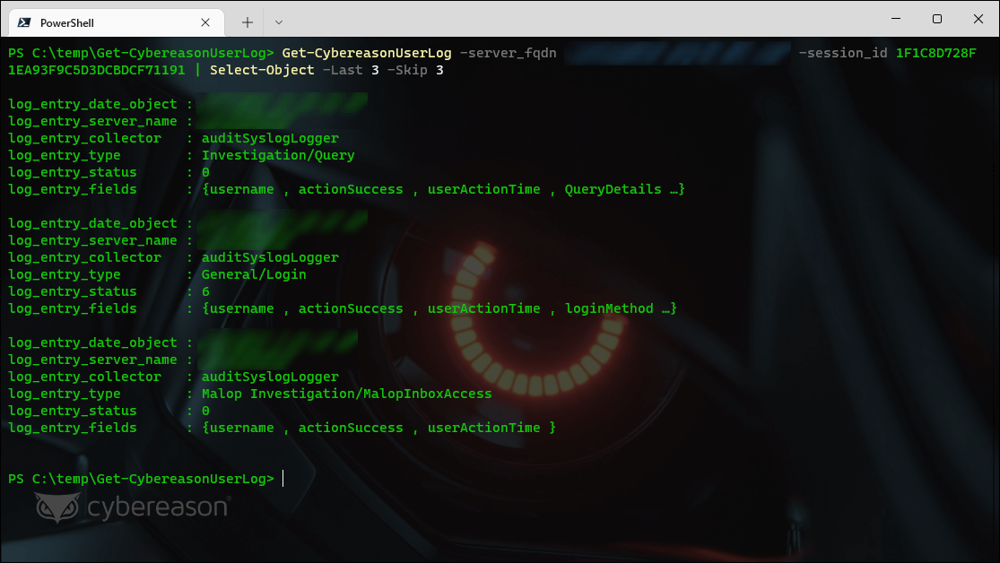

# [Get-CybereasonUserLog 1.0.0](https://github.com/Cybereason-Fan/Get-CybereasonUserLog)

### Fetches the contents of the Cybereason 'User Actions Log' from an on-premises Cybereason API
> Requires an account on an on-premises Cybereason management console



❗ You must load this script as a "dot sourced" script (see the screenshot above!)
```
. .\Get-CybereasonUserLog.ps1
```
```
SYNTAX
    Get-CybereasonUserLog [-session_id] <String> [-server_fqdn] <String> [-debug_mode] [<CommonParameters>]


DESCRIPTION
    Fetches the contents of the Cybereason 'User Actions Log' and returns a parsable array. The output will be an array of various types of log entry types. It will be up to you what to do next!

Warning: Any log entries without 'auditSyslogLogger' will be ignored by this script. This is mainly due to the presence of uncontrolled "test" messages that can be added to the log by administrators.
``` 

❓ Not sure where to get the session id? Try [Get-CybereasonCookie](https://github.com/Cybereason-Fan/Get-CybereasonCookie)

## 1.0.0

Initial Release
